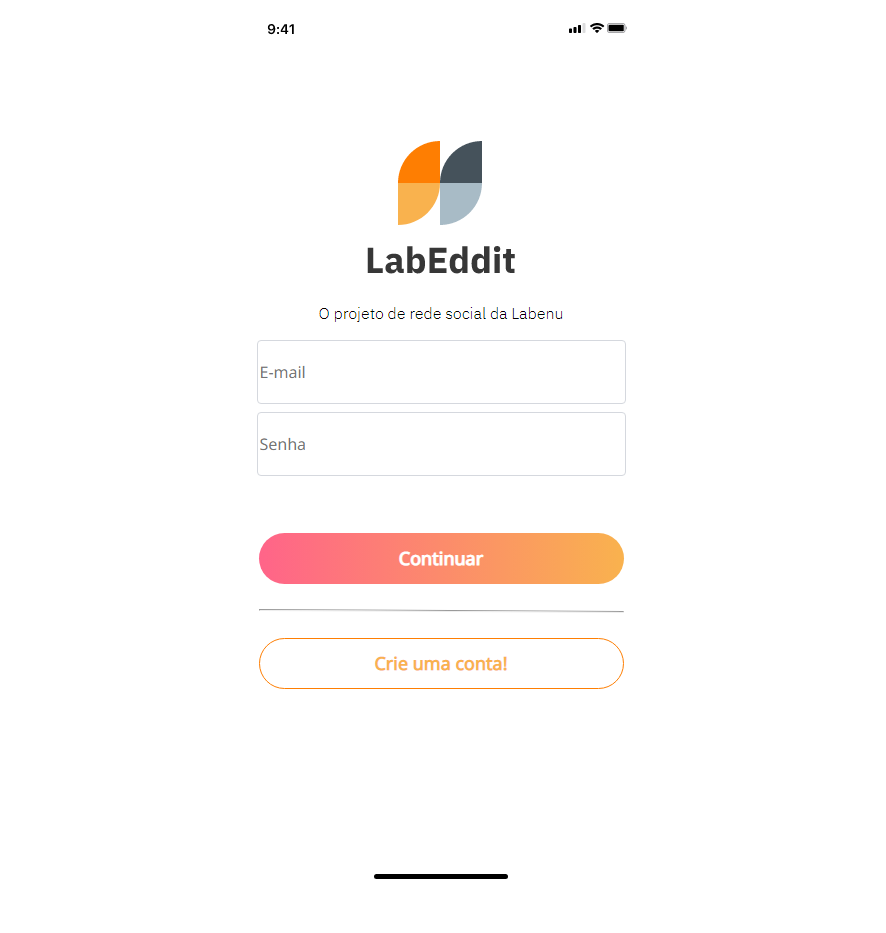

# **Projeto Labeddit**

O Labeddit é uma rede social com o objetivo de promover a conexão e interação entre pessoas. Quem se cadastrar no aplicativo poderá criar, curtir e comentar publicações.

Nesse projeto foram aplicados os conceitos de implementação de segurança e códigos mais escaláveis, tais como Arquitetura em camadas, Programação Orientada a Objetos(POO), senhas com hash(protegidas). Os usuários para estarem logados precisavam de um token autenticado e autorizado.

## 🔍**Índice**

- [Funcionalidades do projeto](#-funcionalidades-do-projeto)
- [Layout](#-layout)
- [Demonstração](#-demonstração)
- [Como rodar esse projeto?](#-como-rodar-esse-projeto?)
- [Tecnologias utilizadas](#-tecnologias-utilizadas)
- [Pessoas autoras](#-pessoas-autoras)

## 💻 **Funcionalidades do Projeto**


- Endpoints
  - [x] signup
  - [x] login
  - [x] get posts
  - [x] create post
  - [x] edit post
  - [x] delete post
  - [x] like / dislike post
  - [x] get comments
  - [x] create comment
  - [x] delete comment
  - [x] like / dislike comment

## 🖼 **Layout**



## 🎯 **Demonstração**

[Link Back-End](https://github.com/brunomaschietto/Labeddit-BackEnd) </br>
[Link demonstração](https://labeddit-front-end-three.vercel.app/)

## 🕹 **Como rodar esse projeto?**

```
# Clone esse repositório
$ git clone link-repositório

# Acesse a pasta do projeto no seu terminal
$ cd Labeddit-FrontEnd

# Instale as dependências
$ npm install

# Execute a aplicação
$ npm run dev
```

## ⚙️ **Tecnologias Utilizadas**

1. [React.js](https://legacy.reactjs.org/docs/getting-started.html)
2. [Styled-Components](https://styled-components.com/)
3. [React Router Dom](https://reactrouter.com/en/main)

## 👩🏻‍💻 **Pessoas autoras**

<p>Bruno Maschietto Simões Cruz</p>

[LinkedIn](https://www.linkedin.com/in/bruno-maschietto/)
